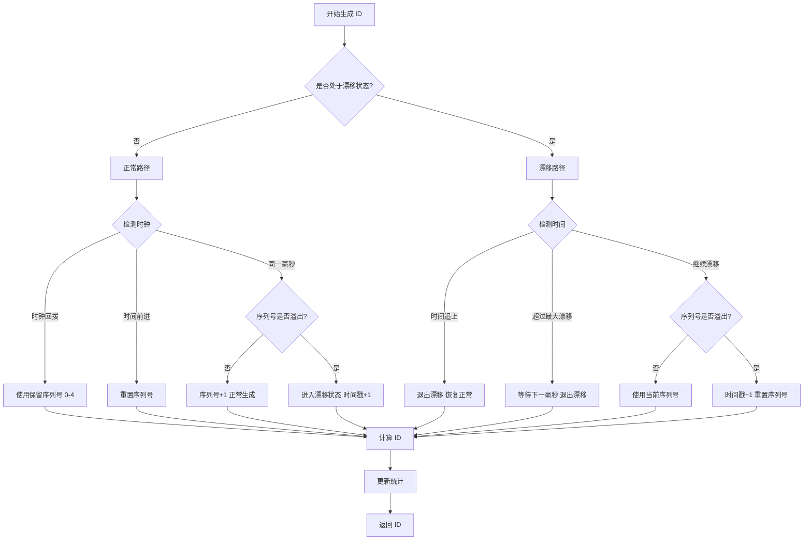

# @cdlab996/genid

一个基于 Snowflake 算法的高性能分布式唯一 ID 生成器。

## 特性

- 🚀 **漂移算法**：高并发场景下性能优异
- 🔄 **时钟回拨处理**：优雅处理时钟回拨，不阻塞 ID 生成
- ⚙️ **灵活配置**：支持自定义位长度分配
- 📊 **性能监控**：内置统计和调试功能

## 架构设计

### 核心流程



### ID 结构（64-bit）

```
|------------ 时间戳 ------------|-- 工作节点 ID --|-- 序列号 --|
        42-52 bits                    1-15 bits        3-21 bits
```

**位分配示例（默认配置）：**

- 时间戳：52 bits（可用约 139 年）
- 工作节点 ID：6 bits（支持 64 个节点）
- 序列号：6 bits（每毫秒 59 个 ID，5-63）

**序列号分配：**

- `0-4`：保留用于时钟回拨
- `5-maxSeqNumber`：正常使用

## 快速开始

```typescript
import { GenidOptimized } from '@cdlab996/genid'

// 创建实例（每个 Worker/进程使用不同的 workerId）
const genid = new GenidOptimized({ workerId: 1 })

// 生成 ID
const id = genid.nextId()
console.log(id) // 123456789012345
```

## API 参考

### 构造函数

```typescript
new GenidOptimized(options: GenidOptions)
```

**配置选项**

| 参数 | 类型 | 必填 | 默认值 | 说明 |
|------|------|------|--------|------|
| `workerId` | number | ✅ | - | 工作节点 ID（范围：0 到 2^workerIdBitLength-1） |
| `method` | GenidMethod | ❌ | `DRIFT` | 算法类型：`DRIFT` 或 `TRADITIONAL` |
| `baseTime` | number | ❌ | `1577836800000` | 起始时间戳（毫秒，默认：2020-01-01） |
| `workerIdBitLength` | number | ❌ | `6` | 工作节点 ID 位数（1-15） |
| `seqBitLength` | number | ❌ | `6` | 序列号位数（3-21） |
| `maxSeqNumber` | number | ❌ | `2^seqBitLength-1` | 最大序列号 |
| `minSeqNumber` | number | ❌ | `5` | 最小序列号（0-4 保留用于时钟回拨） |
| `topOverCostCount` | number | ❌ | `2000` | 最大漂移次数 |

### 生成 ID

#### `nextId()`

返回 Number 或 BigInt 类型的 ID（自动选择）

```typescript
const id = genid.nextId()
```

#### `nextNumber()`

返回 Number 类型的 ID（超出安全范围会抛出错误）

```typescript
const id = genid.nextNumber()
```

#### `nextBigId()`

返回 BigInt 类型的 ID

```typescript
const id = genid.nextBigId()
```

#### `nextBatch(count, asBigInt?)`

批量生成 ID

```typescript
const ids = genid.nextBatch(100)          // 生成 100 个 ID
const bigIds = genid.nextBatch(100, true) // 生成 100 个 BigInt ID
```

### 解析 ID

#### `parse(id)`

解析 ID，提取组成部分

```typescript
const info = genid.parse(id)
console.log(info)
// {
//   timestamp: Date,      // 生成时间
//   timestampMs: 1609459200000,
//   workerId: 1,         // 工作节点 ID
//   sequence: 42         // 序列号
// }
```

### 统计与配置

#### `getStats()`

获取生成器统计信息

```typescript
const stats = genid.getStats()
// {
//   totalGenerated: 1000,    // 总生成数量
//   overCostCount: 10,       // 漂移次数
//   turnBackCount: 2,        // 时钟回拨次数
//   uptimeMs: 60000,         // 运行时间
//   avgPerSecond: 16,        // 每秒平均生成量
//   currentState: 'NORMAL'   // 当前状态
// }
```

#### `getConfig()`

获取配置信息

```typescript
const config = genid.getConfig()
// {
//   method: 'DRIFT',
//   workerId: 1,
//   workerIdRange: '0-63',
//   sequenceRange: '5-63',
//   idsPerMillisecond: 59,
//   baseTime: Date,
//   timestampBits: 52,
//   workerIdBits: 6,
//   sequenceBits: 6
// }
```

#### `resetStats()`

重置统计数据

```typescript
genid.resetStats()
```

### 调试工具

#### `formatBinary(id)`

格式化 ID 为二进制字符串

```typescript
console.log(genid.formatBinary(id))
// ID: 123456789012345
// Binary (64-bit):
// 0000000000011010... - 时间戳 (52 bits) = 2025-10-17T...
// 000001 - 工作节点 ID (6 bits) = 1
// 101010 - 序列号 (6 bits) = 42
```

## 使用示例

### 基础用法

```typescript
const genid = new GenidOptimized({ 
  workerId: 1 
})

// 生成单个 ID
const id1 = genid.nextId()

// 批量生成
const ids = genid.nextBatch(1000)
```

### 自定义配置

```typescript
const genid = new GenidOptimized({
  workerId: 1,
  method: GenidMethod.TRADITIONAL,
  baseTime: new Date('2024-01-01').valueOf(),
  workerIdBitLength: 10,  // 支持 1024 个节点
  seqBitLength: 12,       // 每毫秒 4096 个 ID
  topOverCostCount: 5000
})
```

### 监控性能

```typescript
// 定期检查统计信息
setInterval(() => {
  const stats = genid.getStats()
  console.log(`生成速率: ${stats.avgPerSecond} ID/秒`)
  console.log(`漂移次数: ${stats.overCostCount}`)
}, 10000)
```

## 算法模式

### DRIFT（漂移模式，推荐）

- 高并发下性能更好
- 允许时间戳漂移以避免等待
- 适合高频 ID 生成场景

### TRADITIONAL（传统模式）

- 严格按时间戳递增
- 序列号耗尽时等待下一毫秒
- 适合对时间顺序要求严格的场景

## 注意事项

⚠️ **重要提示**

- 每个 Worker/进程必须使用**不同的 workerId**
- 实例**不是线程安全的**，不要跨线程共享
- `workerIdBitLength + seqBitLength` 不能超过 22
- 序列号 0-4 保留用于时钟回拨处理
- JavaScript 安全整数范围：`-(2^53-1)` 到 `2^53-1`

## 性能指标

- 单实例吞吐量：> 50,000 ID/秒
- 默认配置下每毫秒可生成：59 个唯一 ID
- 支持的最大节点数：2^workerIdBitLength（默认 64 个）
- 时间戳可用时长：约 139 年（52 bits，从 baseTime 起算）

## 📜 License

[MIT](./LICENSE) License © 2025-PRESENT [wudi](https://github.com/WuChenDi)
