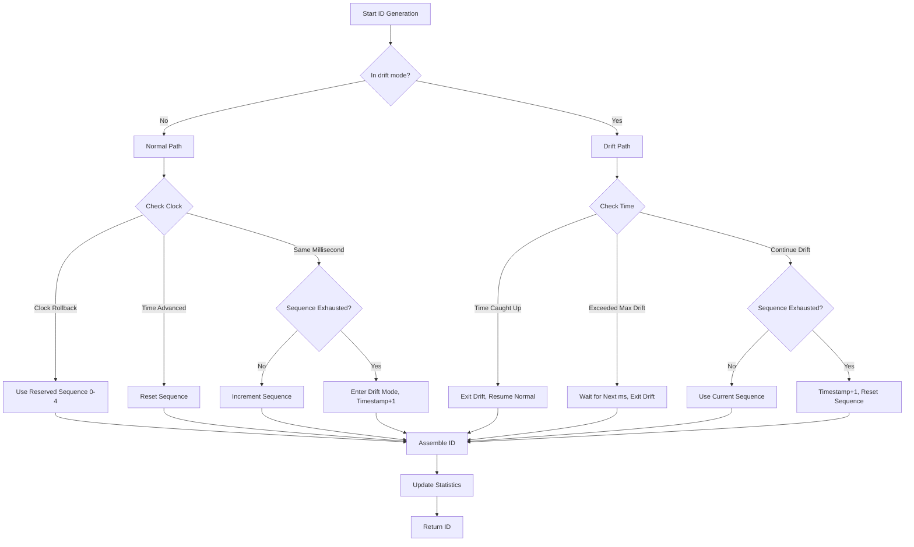

# @cdlab996/genid

[](https://www.npmjs.com/package/@cdlab996/genid)
[](./LICENSE)

High-performance distributed unique ID generator based on the Snowflake algorithm, with drift mode and clock-rollback handling.

[中文文档](./README.zh-CN.md)

## Features

- **Drift Algorithm** - Exceeds per-millisecond sequence limits under high concurrency for better throughput
- **Clock Rollback Handling** - Graceful degradation using reserved sequence numbers without blocking ID generation
- **Flexible Configuration** - Customize bit allocation for timestamp, worker ID, and sequence
- **ID Validation** - Strict and loose validation modes with `afterTime` support
- **Runtime Monitoring** - Built-in statistics, parsing, and binary formatting for debugging

## Installation

```bash
# npm
npm install @cdlab996/genid

# pnpm
pnpm add @cdlab996/genid
```

## Quick Start

```typescript
import { GenidOptimized } from '@cdlab996/genid'

// Create an instance (use a different workerId for each worker/process)
const genid = new GenidOptimized({ workerId: 1 })

// Generate an ID
const id = genid.nextId()

// Batch generate
const ids = genid.nextBatch(1000)

// Parse an ID
const info = genid.parse(id)
// => { timestamp: Date, timestampMs: 1609459200000, workerId: 1, sequence: 42 }

// Validate an ID
genid.isValid(id) // true
```

## API

### `new GenidOptimized(options)`

| Parameter           | Type          | Required | Default            | Description                                         |
| ------------------- | ------------- | :------: | ------------------ | --------------------------------------------------- |
| `workerId`          | `number`      |   Yes    | -                  | Worker node ID (0 to 2^workerIdBitLength-1)         |
| `method`            | `GenidMethod` |          | `DRIFT`            | Algorithm: `DRIFT` or `TRADITIONAL`                 |
| `baseTime`          | `number`      |          | `1577836800000`    | Base timestamp in ms (default: 2020-01-01)          |
| `workerIdBitLength` | `number`      |          | `6`                | Bit length for worker ID (1-15)                     |
| `seqBitLength`      | `number`      |          | `6`                | Bit length for sequence (3-21)                      |
| `maxSeqNumber`      | `number`      |          | `2^seqBitLength-1` | Maximum sequence number                             |
| `minSeqNumber`      | `number`      |          | `5`                | Minimum sequence number (0-4 reserved for rollback) |
| `topOverCostCount`  | `number`      |          | `2000`             | Maximum drift count                                 |

### Generating IDs

```typescript
genid.nextId()             // Returns number | bigint (auto-selects)
genid.nextNumber()         // Returns number (throws if exceeds safe integer range)
genid.nextBigId()          // Returns bigint
genid.nextBatch(100)       // Batch generate 100 IDs
genid.nextBatch(100, true) // Batch generate 100 BigInt IDs
```

### Parsing & Validation

```typescript
// Parse an ID into its components
genid.parse(id)
// => { timestamp: Date, timestampMs: number, workerId: number, sequence: number }

// Loose validation: checks structural validity
genid.isValid(id)            // true
genid.isValid('invalid')     // false

// Strict validation: requires workerId to match the current instance
genid.isValid(id, true)      // true (generated by this instance)
genid.isValid(otherId, true) // false (generated by another instance)

// Time-bound validation: reject IDs generated before a given time
const startupTime = Date.now()
genid.isValid(id, { afterTime: startupTime })                       // true
genid.isValid(id, { strictWorkerId: true, afterTime: startupTime }) // combined
```

### Statistics & Configuration

```typescript
// Get runtime statistics
genid.getStats()
// => {
//   totalGenerated: 1000,
//   overCostCount: 10,
//   turnBackCount: 2,
//   uptimeMs: 60000,
//   avgPerSecond: 16,
//   currentState: 'NORMAL' | 'OVER_COST'
// }

// Get current configuration
genid.getConfig()
// => {
//   method: 'DRIFT',
//   workerId: 1,
//   workerIdRange: '0-63',
//   sequenceRange: '5-63',
//   maxSequence: 63,
//   idsPerMillisecond: 59,
//   baseTime: Date,
//   timestampBits: 52,
//   workerIdBits: 6,
//   sequenceBits: 6
// }

// Reset statistics
genid.resetStats()
```

### Debugging

```typescript
genid.formatBinary(id)
// ID: 123456789012345
// Binary (64-bit):
// 0000000000011010... - Timestamp (52 bits) = 2025-10-17T...
// 000001 - Worker ID (6 bits) = 1
// 101010 - Sequence (6 bits) = 42
```

## Examples

### Custom Bit Allocation

```typescript
import { GenidOptimized, GenidMethod } from '@cdlab996/genid'

const genid = new GenidOptimized({
  workerId: 1,
  method: GenidMethod.TRADITIONAL,
  baseTime: new Date('2024-01-01').valueOf(),
  workerIdBitLength: 10, // Support 1024 nodes
  seqBitLength: 12,      // 4096 IDs per millisecond
  topOverCostCount: 5000,
})
```

### Validating External IDs

```typescript
// Validate IDs from a database or API
const externalId = '123456789012345'
if (genid.isValid(externalId)) {
  const info = genid.parse(externalId)
  console.log('Generated at:', info.timestamp)
  console.log('From worker:', info.workerId)
} else {
  console.error('Invalid ID')
}
```

### Performance Monitoring

```typescript
setInterval(() => {
  const stats = genid.getStats()
  console.log(`Rate: ${stats.avgPerSecond} ID/s | Drift: ${stats.overCostCount} | Rollback: ${stats.turnBackCount}`)
}, 10000)
```

## Algorithm Modes

| Mode                | Description                                                        | Use Case                      |
| ------------------- | ------------------------------------------------------------------ | ----------------------------- |
| **DRIFT** (default) | Borrows future timestamps when sequence is exhausted; avoids waits | High-frequency ID generation  |
| **TRADITIONAL**     | Strictly increasing timestamps; waits for next ms on exhaustion    | Strict time-ordering required |

## Architecture

### ID Structure (64-bit)

```
|------------ Timestamp ------------|-- Worker ID --|-- Sequence --|
        42-52 bits                      1-15 bits       3-21 bits
```

Default: Timestamp 52 bits (~139 years) | Worker ID 6 bits (64 nodes) | Sequence 6 bits (59 IDs/ms)

Sequence values `0-4` are reserved for clock rollback; normal generation starts at `5`.

### Core Flow


```mermaid
graph TB
    A[Start ID Generation] --> B{In drift mode?}

    B -->|No| C[Normal Path]
    B -->|Yes| D[Drift Path]

    C --> E{Check Clock}
    E -->|Clock Rollback| F[Use Reserved Sequence 0-4]
    E -->|Time Advanced| G[Reset Sequence]
    E -->|Same Millisecond| H{Sequence Exhausted?}

    H -->|No| I[Increment Sequence]
    H -->|Yes| J[Enter Drift Mode, Timestamp+1]

    D --> K{Check Time}
    K -->|Time Caught Up| L[Exit Drift, Resume Normal]
    K -->|Exceeded Max Drift| M[Wait for Next ms, Exit Drift]
    K -->|Continue Drift| N{Sequence Exhausted?}

    N -->|No| O[Use Current Sequence]
    N -->|Yes| P[Timestamp+1, Reset Sequence]

    F --> Q[Assemble ID]
    G --> Q
    I --> Q
    J --> Q
    L --> Q
    M --> Q
    O --> Q
    P --> Q

    Q --> R[Update Statistics]
    R --> S[Return ID]
```

## Performance

Throughput is determined by the number of available sequence slots per millisecond. Increasing `seqBitLength` scales linearly:

|  seqBitLength   | Slots/ms |          Throughput |
| :-------------: | -------: | ------------------: |
|        3        |        3 |      ~3,000 IDs/sec |
|        4        |       11 |     ~11,000 IDs/sec |
| **6** (default) |   **59** | **~58,000 IDs/sec** |
|        8        |      251 |    ~247,000 IDs/sec |
|       10        |    1,019 |  ~1,000,000 IDs/sec |
|       14        |   16,379 |  ~4,500,000 IDs/sec |

> Measured on Node.js v22 (x64). Actual results vary by environment.
> Run `pnpm run benchmark` to probe your own machine.

| Metric                    | Value (default config) |
| ------------------------- | ---------------------: |
| Max worker nodes          |                     64 |
| Timestamp lifespan        |             ~139 years |
| P99 latency (single call) |                  < 1µs |

## Benchmark

A built-in probe script measures the actual capability of the current environment:

```bash
pnpm run benchmark
```

It reports:

1. **Single-call throughput** — peak `nextId()` IDs/sec
2. **Batch throughput** — `nextBatch()` across different batch sizes
3. **Latency percentiles** — P50 / P95 / P99 / P99.9 / Max
4. **Algorithm comparison** — DRIFT vs TRADITIONAL side-by-side
5. **Throughput by seqBitLength** — how bit allocation affects throughput
6. **Memory footprint** — heap delta after 1M generations
7. **Recommended thresholds** — suggested safe values for test assertions (60% of peak)

<details>
<summary>Example output</summary>

```bash
station :: /app/projects/genid ‹main*› » pnpm run benchmark

> @cdlab996/genid@1.4.0 benchmark /app/projects/genid
> npx tsx scripts/benchmark.ts

============================================================
  GenidOptimized — Environment Capability Probe
  Node v22.22.0 | linux x64
  Date: 2026-04-01T08:41:07.669Z
============================================================

────────────────────────────────────────────────────────────
  1. Single-call throughput (nextId)
────────────────────────────────────────────────────────────
  Duration:   3001ms
  Generated:  226,073
  Throughput: 75,332 IDs/sec

────────────────────────────────────────────────────────────
  2. Batch throughput (nextBatch)
────────────────────────────────────────────────────────────
  batch=    100 × 5000  =>        61,665 IDs/sec
  batch=  1,000 ×  500  =>        61,577 IDs/sec
  batch= 10,000 ×   50  =>        61,716 IDs/sec
  batch=100,000 ×    5  =>        61,644 IDs/sec

────────────────────────────────────────────────────────────
  3. Single-call latency percentiles
────────────────────────────────────────────────────────────
  Samples: 100,000
  Avg:     0µs
  P50:     0µs
  P95:     1µs
  P99:     1µs
  P99.9:   1µs
  Max:     364µs

────────────────────────────────────────────────────────────
  4. Algorithm comparison (DRIFT vs TRADITIONAL)
────────────────────────────────────────────────────────────
  DRIFT              58,296 IDs/sec   drift=1
  TRADITIONAL        59,000 IDs/sec   drift=0

────────────────────────────────────────────────────────────
  5. Throughput by sequence bit length
────────────────────────────────────────────────────────────
  seqBits= 3  maxSeq=    7  =>         2,986 IDs/sec   drift=1
  seqBits= 4  maxSeq=   15  =>        10,884 IDs/sec   drift=1
  seqBits= 6  maxSeq=   63  =>        58,240 IDs/sec   drift=1
  seqBits= 8  maxSeq=  255  =>       247,804 IDs/sec   drift=1
  seqBits=10  maxSeq= 1023  =>     1,008,930 IDs/sec   drift=1
  seqBits=14  maxSeq=16383  =>     4,130,701 IDs/sec   drift=0

────────────────────────────────────────────────────────────
  6. Memory footprint
────────────────────────────────────────────────────────────
  Generated:    1,000,000 IDs (not stored)
  Heap delta:   -6.27 MB
  Note: Run with --expose-gc for accurate GC-forced measurement

────────────────────────────────────────────────────────────
  Summary — Recommended test thresholds
────────────────────────────────────────────────────────────
  Peak single-call:        75,332 IDs/sec
  Peak batch:              61,716 IDs/sec
  Suggested min threshold: 45,199 IDs/sec  (60% of peak)
  Suggested batch threshold: 37,029 IDs/sec  (60% of peak)
  Suggested P99 cap:       2µs  (3× measured P99)
```

</details>

## Development

```bash
pnpm install          # Install dependencies
pnpm run build        # Build (ESM + CJS)
pnpm run dev          # Watch mode
pnpm run test         # Run tests
pnpm run benchmark    # Run environment capability probe
pnpm run typecheck    # Type check
pnpm run lint         # Lint (Biome)
pnpm run format       # Format (Biome)
```

## Notes

- Each worker/process must use a **unique workerId**
- Instances are **not thread-safe** — do not share across threads
- `workerIdBitLength + seqBitLength` must not exceed 22
- Sequence values 0-4 are reserved for clock-rollback handling
- When IDs exceed the JavaScript safe integer range (2^53-1), use `nextBigId()` or `nextId()` (auto-returns BigInt)

## License

[MIT](./LICENSE) License © 2025-PRESENT [wudi](https://github.com/WuChenDi)
