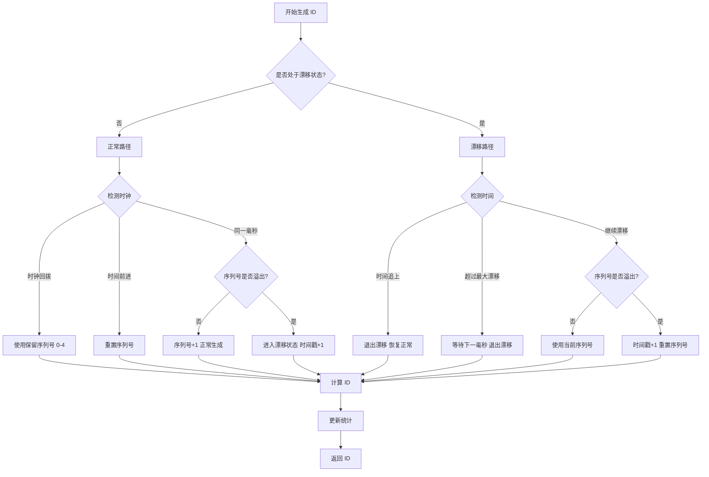

# @cdlab996/genid

[](https://www.npmjs.com/package/@cdlab996/genid)
[](./LICENSE)

基于 Snowflake 算法的高性能分布式唯一 ID 生成器，支持漂移算法和时钟回拨处理。

[English](./README.md)

## 特性

- **漂移算法** - 高并发场景下突破每毫秒序列号上限，性能更优
- **时钟回拨处理** - 使用保留序列号优雅降级，不阻塞 ID 生成
- **灵活配置** - 支持自定义时间戳、节点 ID、序列号的位长度分配
- **ID 验证** - 支持严格/宽松模式校验，支持 `afterTime` 时间下限约束
- **运行监控** - 内置统计、解析和二进制格式化调试工具

## 安装

```bash
# npm
npm install @cdlab996/genid

# pnpm
pnpm add @cdlab996/genid
```

## 快速开始

```typescript
import { GenidOptimized } from '@cdlab996/genid'

// 创建实例（每个 Worker/进程使用不同的 workerId）
const genid = new GenidOptimized({ workerId: 1 })

// 生成 ID
const id = genid.nextId()

// 批量生成
const ids = genid.nextBatch(1000)

// 解析 ID
const info = genid.parse(id)
// => { timestamp: Date, timestampMs: 1609459200000, workerId: 1, sequence: 42 }

// 验证 ID
genid.isValid(id) // true
```

## API

### `new GenidOptimized(options)`

| 参数                | 类型          | 必填  | 默认值             | 说明                                          |
| ------------------- | ------------- | :---: | ------------------ | --------------------------------------------- |
| `workerId`          | `number`      |  Yes  | -                  | 工作节点 ID（0 ~ 2^workerIdBitLength-1）      |
| `method`            | `GenidMethod` |       | `DRIFT`            | 算法：`DRIFT`（漂移）或 `TRADITIONAL`（传统） |
| `baseTime`          | `number`      |       | `1577836800000`    | 起始时间戳，毫秒（默认 2020-01-01）           |
| `workerIdBitLength` | `number`      |       | `6`                | 节点 ID 位数（1-15）                          |
| `seqBitLength`      | `number`      |       | `6`                | 序列号位数（3-21）                            |
| `maxSeqNumber`      | `number`      |       | `2^seqBitLength-1` | 最大序列号                                    |
| `minSeqNumber`      | `number`      |       | `5`                | 最小序列号（0-4 保留用于时钟回拨）            |
| `topOverCostCount`  | `number`      |       | `2000`             | 最大漂移次数                                  |

### 生成 ID

```typescript
genid.nextId()            // 返回 number | bigint（自动选择）
genid.nextNumber()        // 返回 number（超出安全整数范围抛错）
genid.nextBigId()         // 返回 bigint
genid.nextBatch(100)      // 批量生成 100 个 ID
genid.nextBatch(100, true) // 批量生成 100 个 BigInt ID
```

### 解析与验证

```typescript
// 解析 ID 的组成部分
genid.parse(id)
// => { timestamp: Date, timestampMs: number, workerId: number, sequence: number }

// 宽松验证：检查 ID 结构是否有效
genid.isValid(id)            // true
genid.isValid('invalid')     // false

// 严格验证：要求 workerId 匹配当前实例
genid.isValid(id, true)      // true（本实例生成的 ID）
genid.isValid(otherId, true) // false（其他实例生成的 ID）

// 时间下限验证：拒绝早于指定时间生成的 ID
const startupTime = Date.now()
genid.isValid(id, { afterTime: startupTime })                       // true
genid.isValid(id, { strictWorkerId: true, afterTime: startupTime }) // 组合使用
```

### 统计与配置

```typescript
// 获取运行统计
genid.getStats()
// => {
//   totalGenerated: 1000,
//   overCostCount: 10,
//   turnBackCount: 2,
//   uptimeMs: 60000,
//   avgPerSecond: 16,
//   currentState: 'NORMAL' | 'OVER_COST'
// }

// 获取当前配置
genid.getConfig()
// => {
//   method: 'DRIFT',
//   workerId: 1,
//   workerIdRange: '0-63',
//   sequenceRange: '5-63',
//   maxSequence: 63,
//   idsPerMillisecond: 59,
//   baseTime: Date,
//   timestampBits: 52,
//   workerIdBits: 6,
//   sequenceBits: 6
// }

// 重置统计
genid.resetStats()
```

### 调试

```typescript
genid.formatBinary(id)
// ID: 123456789012345
// Binary (64-bit):
// 0000000000011010... - Timestamp (52 bits) = 2025-10-17T...
// 000001 - Worker ID (6 bits) = 1
// 101010 - Sequence (6 bits) = 42
```

## 使用示例

### 自定义位分配

```typescript
import { GenidOptimized, GenidMethod } from '@cdlab996/genid'

const genid = new GenidOptimized({
  workerId: 1,
  method: GenidMethod.TRADITIONAL,
  baseTime: new Date('2024-01-01').valueOf(),
  workerIdBitLength: 10, // 支持 1024 个节点
  seqBitLength: 12,      // 每毫秒 4096 个 ID
  topOverCostCount: 5000,
})
```

### 验证外部 ID

```typescript
// 验证从数据库或 API 获取的 ID
const externalId = '123456789012345'
if (genid.isValid(externalId)) {
  const info = genid.parse(externalId)
  console.log('生成时间:', info.timestamp)
  console.log('来自节点:', info.workerId)
} else {
  console.error('无效 ID')
}
```

### 性能监控

```typescript
setInterval(() => {
  const stats = genid.getStats()
  console.log(`速率: ${stats.avgPerSecond} ID/s | 漂移: ${stats.overCostCount} | 回拨: ${stats.turnBackCount}`)
}, 10000)
```

## 算法模式

| 模式              | 说明                                     | 适用场景             |
| ----------------- | ---------------------------------------- | -------------------- |
| **DRIFT**（默认） | 序列号耗尽时借用未来时间戳，避免等待     | 高频 ID 生成、高并发 |
| **TRADITIONAL**   | 严格按时间戳递增，序列号耗尽等待下一毫秒 | 对时间顺序严格要求   |

## 架构

### ID 结构（64-bit）

```
|------------ 时间戳 ------------|-- 工作节点 ID --|-- 序列号 --|
        42-52 bits                    1-15 bits        3-21 bits
```

默认配置：时间戳 52 bits（约 139 年）| 节点 ID 6 bits（64 个节点）| 序列号 6 bits（每毫秒 59 个 ID）

序列号 `0-4` 保留用于时钟回拨，正常使用从 `5` 开始。

### 核心流程



## 性能

吞吐量由每毫秒可用序列号槽位数决定，增大 `seqBitLength` 可线性提升：

| seqBitLength  | 每毫秒槽位 |              吞吐量 |
| :-----------: | ---------: | ------------------: |
|       3       |          3 |      ~3,000 IDs/sec |
|       4       |         11 |     ~11,000 IDs/sec |
| **6**（默认） |     **59** | **~58,000 IDs/sec** |
|       8       |        251 |    ~247,000 IDs/sec |
|      10       |      1,019 |  ~1,000,000 IDs/sec |
|      14       |     16,379 |  ~4,500,000 IDs/sec |

> 基于 Node.js v22 (x64) 测量，实际结果因环境而异。
> 运行 `pnpm run benchmark` 可探测当前机器的实际能力。

| 指标                 | 数值（默认配置） |
| -------------------- | ---------------: |
| 最大节点数           |               64 |
| 时间戳可用时长       |          ~139 年 |
| P99 延迟（单次调用） |            < 1µs |

## Benchmark

内置探测脚本，自动测量当前环境的实际性能上限：

```bash
pnpm run benchmark
```

输出内容：

1. **单次调用吞吐量** — `nextId()` 峰值 IDs/sec
2. **批量吞吐量** — 不同批次大小的 `nextBatch()` 性能
3. **延迟分位数** — P50 / P95 / P99 / P99.9 / Max
4. **算法对比** — DRIFT vs TRADITIONAL 并排对比
5. **不同 seqBitLength 吞吐量** — 位分配对吞吐量的影响
6. **内存占用** — 生成 100 万 ID 后的堆内存变化
7. **推荐阈值** — 基于峰值 60% 给出的安全测试断言值

<details>
<summary>输出示例</summary>

```bash
station :: /app/projects/genid ‹main*› » pnpm run benchmark

> @cdlab996/genid@1.4.0 benchmark /app/projects/genid
> npx tsx scripts/benchmark.ts

============================================================
  GenidOptimized — Environment Capability Probe
  Node v22.22.0 | linux x64
  Date: 2026-04-01T08:41:07.669Z
============================================================

────────────────────────────────────────────────────────────
  1. Single-call throughput (nextId)
────────────────────────────────────────────────────────────
  Duration:   3001ms
  Generated:  226,073
  Throughput: 75,332 IDs/sec

────────────────────────────────────────────────────────────
  2. Batch throughput (nextBatch)
────────────────────────────────────────────────────────────
  batch=    100 × 5000  =>        61,665 IDs/sec
  batch=  1,000 ×  500  =>        61,577 IDs/sec
  batch= 10,000 ×   50  =>        61,716 IDs/sec
  batch=100,000 ×    5  =>        61,644 IDs/sec

────────────────────────────────────────────────────────────
  3. Single-call latency percentiles
────────────────────────────────────────────────────────────
  Samples: 100,000
  Avg:     0µs
  P50:     0µs
  P95:     1µs
  P99:     1µs
  P99.9:   1µs
  Max:     364µs

────────────────────────────────────────────────────────────
  4. Algorithm comparison (DRIFT vs TRADITIONAL)
────────────────────────────────────────────────────────────
  DRIFT              58,296 IDs/sec   drift=1
  TRADITIONAL        59,000 IDs/sec   drift=0

────────────────────────────────────────────────────────────
  5. Throughput by sequence bit length
────────────────────────────────────────────────────────────
  seqBits= 3  maxSeq=    7  =>         2,986 IDs/sec   drift=1
  seqBits= 4  maxSeq=   15  =>        10,884 IDs/sec   drift=1
  seqBits= 6  maxSeq=   63  =>        58,240 IDs/sec   drift=1
  seqBits= 8  maxSeq=  255  =>       247,804 IDs/sec   drift=1
  seqBits=10  maxSeq= 1023  =>     1,008,930 IDs/sec   drift=1
  seqBits=14  maxSeq=16383  =>     4,130,701 IDs/sec   drift=0

────────────────────────────────────────────────────────────
  6. Memory footprint
────────────────────────────────────────────────────────────
  Generated:    1,000,000 IDs (not stored)
  Heap delta:   -6.27 MB
  Note: Run with --expose-gc for accurate GC-forced measurement

────────────────────────────────────────────────────────────
  Summary — Recommended test thresholds
────────────────────────────────────────────────────────────
  Peak single-call:        75,332 IDs/sec
  Peak batch:              61,716 IDs/sec
  Suggested min threshold: 45,199 IDs/sec  (60% of peak)
  Suggested batch threshold: 37,029 IDs/sec  (60% of peak)
  Suggested P99 cap:       2µs  (3× measured P99)
```

</details>

## 开发

```bash
pnpm install          # 安装依赖
pnpm run build        # 构建（ESM + CJS）
pnpm run dev          # 监听模式
pnpm run test         # 运行测试
pnpm run benchmark    # 运行环境性能探测
pnpm run typecheck    # 类型检查
pnpm run lint         # 代码检查（Biome）
pnpm run format       # 代码格式化（Biome）
```

## 注意事项

- 每个 Worker/进程必须使用**不同的 workerId**
- 实例**非线程安全**，不要跨线程共享
- `workerIdBitLength + seqBitLength` 不能超过 22
- 序列号 0-4 保留用于时钟回拨处理
- 超出 JavaScript 安全整数范围（2^53-1）时，使用 `nextBigId()` 或 `nextId()`（自动返回 BigInt）

## License

[MIT](./LICENSE) License © 2025-PRESENT [wudi](https://github.com/WuChenDi)
